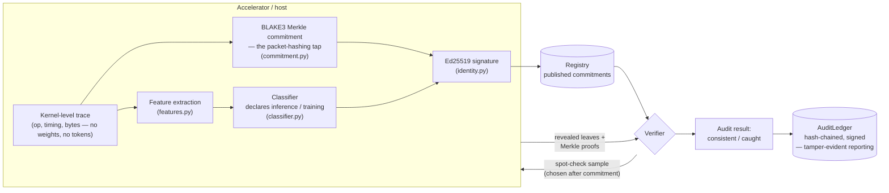

# Fides

**A reference implementation of a packet-hashing inference-only verification tap, built against the AI 2040: Plan A verification agenda.**

[AI 2040: Plan A](https://ai-2040.com/) is the AI Futures Project's (the team behind [AI 2027](https://ai-2027.com/)) recommendation for how the US and China could verifiably slow down the race to superintelligence. The plan's [verification supplement](https://ai-2040.com/supplements/verification-plan) argues the whole deal is only as strong as the ability to check compliance without relying on trust. Amodo Design, the hardware firm prototyping the plan's network-tap-and-recomputation approach, published a [SITREP](https://amododesign.com/ai-verification/plan-a-sitrep/) grading the 17 engineering workstreams that approach needs: 4 active, 6 not started, 7 not on track, and one (memory wipes) graded uncertain.

Fides is a from-scratch, tested, open-source testbed. Of the 11 workstreams with any software-only path at all, it directly and solidly addresses **7**, has a real but honestly-caveated partial connection to **2** more, and does not touch **2**:

| Workstream (SITREP grade) | What Fides does about it |
|---|---|
| **New TAP types & bandwidth limits** (not started) | `commitment.py`: BLAKE3 Merkle-tree packet-hashing tap — commit locally and cheaply, reveal only a small auditor-chosen sample. |
| **Verification reporting** (not on track) | `ledger.py`: hash-chained, signed audit log — a compromised auditor can't quietly rewrite a past finding without breaking the chain. |
| **Reproducible inference stack** (not started) | `determinism.py`: fixed-order deterministic reduction vs. a schedule-dependent one — fixes the specific, well-documented floating-point-reduction-order mechanism, not a full inference stack. |
| **Network reproducibility** (not started) | `packet_reconstruction.py`: content-addressed, order-independent verification that a message was delivered completely and correctly regardless of packet arrival order — the narrower alternative Amodo's own text floats, not bit-exact packet replay. |
| **Recomputation server security** (not on track) | `server_attestation.py`: a challenge-response software heartbeat catching silent logic substitution and history rollback — explicitly a partial mitigation, not a defense against physical compromise. |
| **Memory wipes** (uncertain) | `wipe.py`: forced-memorization wipe with spot-check verification, reusing `security.py`'s exact detection-probability math against a different object (memory blocks instead of trace events). |
| **Side channel wardens** (not on track) | `warden.py`: autocorrelation-based detection of injected periodic signals, with an empirically characterized detection floor and an honestly-documented harmonic-ambiguity limitation. |

**Real but caveated (2):** `recompute.py` builds an independent SimHash-based recomputation-verification construction — not TOPLOC or DiFR, and not a contribution to either becoming production-ready. Its generalization test (three unrelated vector/hash-length configurations) is relevant to the *spirit* of **Frontier recomputation algorithms**, and its red-team tests (brute-force + adaptive hill-climbing) are relevant to the *spirit* of **Recomputation red-teaming** — but both attack `recompute.py`'s own scheme, not the actual algorithms those workstreams name. Read this as "demonstrates the principle is testable," not "makes progress on those two items."

**Not attempted at all (2, downgraded from earlier claims — see below):** **Inference reproducibility workarounds** and **Recomputation algorithms**, both currently active elsewhere via TOPLOC and DiFR specifically. `toploc_reference.py` is a from-scratch reimplementation of TOPLOC's actual algorithm — top-k-by-magnitude selection, polynomial interpolation over GF(65537), graded exponent/mantissa comparison — built by directly reading [PrimeIntellect-ai/toploc](https://github.com/PrimeIntellect-ai/toploc)'s source after `pip install toploc` hit a real ABI mismatch between its prebuilt C extension and the available torch build in this environment (documented, not hidden, in `spec/PROTOCOL.md` section 11). This is meaningfully more accurate than `recompute.py`'s earlier SimHash guess — TOPLOC does not use random-hyperplane hashing — but it is still an independently-implemented, non-bit-compatible reference construction, not a contribution to the actual algorithms being tested on real hardware right now. Read the distinction precisely: verified understanding of the real algorithm, not participation in it.

`accumulator.py` + `zk_verification.py` sit outside this table entirely — see "Two verification mechanisms" below. The 6 fully physical workstreams (passive optical TAPs, recomputation-server traffic capture, the storage-bank-to-inference-unit path, TAP installation, physical security and audits, side-channel shielding) are out of scope for any software project, this repo included. See `spec/PROTOCOL.md` section 9 for the complete, item-by-item audit.

## How it fits together



The prover (device/tap) never reveals the full trace by default — only the small sample the verifier asks for, chosen *after* the commitment is published, so the prover can't predict and hide the bad ones. This mirrors the "packet-based verification" appendix in the [AI 2040 verification supplement](https://ai-2040.com/supplements/verification-plan#appendix-packet-based-verification), which derives the same detection-probability math this repo implements and tests against.

## Two verification mechanisms, not one

`attestation.py` and `zk_verification.py` answer the same question — does the declared workload match what actually ran? — with two different, complementary guarantees:

| | `attestation.py` (Merkle + spot-check) | `zk_verification.py` (RSA accumulator) |
|---|---|---|
| Guarantee | Bounded detection **probability** per epoch, compounding toward certainty over repeated epochs (`security.py`) | Detection **certainty**: a forbidden op's non-membership witness provably cannot be constructed if the op is present |
| What's revealed | A small random sample of raw events, chosen after commitment | Only the accumulator value and non-membership witnesses — no event ever leaves the device |
| Cost | Cheap per epoch; needs many epochs for confidence | One accumulator + 3 witnesses per epoch; RSA exponentiation cost, no sampling |
| What it can express | Anything visible in the revealed sample (timing, byte counts, ordering) | Only set-membership claims ("no forbidden op occurred") over the accumulated set |

Running `examples/demo.py` section [6] reproduces the same subtle covert-training attack from section [3] and catches it 20/20 independent trials under the accumulator, against roughly 40-50% per epoch under sampling — not because one implementation is better than the other, but because they're different kinds of guarantee. See `spec/PROTOCOL.md` section 8 for when you'd actually want each.

## Quickstart

```bash
pip install -e ".[dev]"
python examples/demo.py     # honest device, a blatant liar, a subtle attacker, and a tampered ledger
pytest tests/ -v             # 98 tests
```

The demo runs a device sneaking one covert training step into otherwise-legitimate inference epochs while declaring everything "inference." In a real run it gets caught at epoch 3 out of 15 — consistent with the model's own prediction that a single epoch at this attack size has roughly a 46% catch probability, compounding to >99.7% by epoch 10 (see `examples/demo.py` section 5, and `spec/PROTOCOL.md` section 5).

## What's real here and what isn't

This is a **software testbed**, not hardware, and it should be read that way:

- `trace.py` **simulates** kernel-level execution traces with the statistical shape training and inference workloads are documented to have (backward-pass kernels, optimizer writes, KV-cache growth, gradient vs. activation all-reduce patterns). It does not hook into a real profiler (CUPTI/Nsight) or real GPU traffic. Swapping in a real trace source behind the same `ExecutionEpoch` interface is the natural next step and is the actual "not started" engineering work.
- The commitment, signature, spot-check, and ledger logic are real, tested, and not simplified toy versions of the cryptography — BLAKE3 Merkle proofs and Ed25519 signatures work exactly as they would in a production system, just running in-process instead of on tap hardware sitting inside a datacenter.
- The RSA accumulator in `accumulator.py` is likewise real, tested cryptography, not a simulation of one — but it has a genuine, named limitation: `trusted_setup()` generates the RSA modulus itself, and whoever runs that step could in principle know its factorization and forge proofs. A real deployment needs an actual trusted third party or a multi-party ceremony for that one step; this repo is honest about not solving it, in the same docstring that explains the rest of the math.
- The classifier is intentionally simple and interpretable, not adversarially robust. Section 4 of `spec/PROTOCOL.md` is explicit about what it would take to beat it, and points at the Compute Verification Project's open competition on exactly this problem.

## Repository layout

```
src/fides/
  trace.py         synthetic kernel-event trace generator (training / inference / mixed)
  features.py      privacy-preserving statistical fingerprint of a trace
  classifier.py     interpretable inference-vs-training classifier
  commitment.py     BLAKE3 Merkle commitment + proofs — the packet-hashing tap (#3)
  identity.py       Ed25519 device identity (signing / verification)
  attestation.py    Prover / Verifier: commit, spot-check reveal, audit
  ledger.py         hash-chained, signed audit ledger — verification reporting (#13)
  security.py       detection-probability math (exact + Poisson approximation)
  accumulator.py    RSA accumulator: membership / non-membership proofs (ZK track, outside the 17)
  zk_verification.py ZKProver / ZKVerifier: certainty-based compliance proof (ZK track, outside the 17)
  determinism.py    deterministic vs. racy reduction — reproducible inference stack (#6)
  packet_reconstruction.py  order-independent message verification — network reproducibility (#7)
  recompute.py      SimHash recomputation-verification construction — spirit of #9/#10
  server_attestation.py  challenge-response software heartbeat — recomputation server security (#11)
  wipe.py           forced-memorization memory wipe + spot-check — memory wipes (#15)
  warden.py         autocorrelation-based covert-signal detection — side-channel wardens (#17)
  toploc_reference.py  faithful reimplementation of TOPLOC's real algorithm, read from its source (#5/#8, see honest caveat above)
  protocol.py       Tap: wires prover + verifier + registry + ledger together
spec/PROTOCOL.md     RFC-style writeup: threat model, math, limitations, full 17-item audit
docs/ARCHITECTURE.md  the diagram above plus a walk through each module
examples/demo.py      end-to-end runnable demo (sampling vs. ZK mechanisms)
tests/                98 tests, all passing
```

## References

- Shavit, 2023. [What does it take to catch a Chinchilla?](https://arxiv.org/abs/2303.11341)
- Wasil et al., 2024. [Verification Methods for International AI Agreements](https://arxiv.org/abs/2408.16074)
- Baker et al., 2025 (RAND). [Verifying International Agreements on AI](https://www.rand.org/pubs/working_papers/WRA4077-1.html)
- Petrie et al., 2025. [Flexible Hardware-Enabled Guarantees (flexHEG)](https://arxiv.org/abs/2506.15093)
- Scher & Thiergart, 2025. [Mechanisms to Verify International Agreements About AI Development](https://arxiv.org/abs/2506.15867)
- Harack et al., 2025 (Oxford AIGI). [Verification for International AI Governance](https://aigi.ox.ac.uk/publications/verification-for-international-ai-governance/)
- Rinberg et al., 2025. [Verifying LLM Inference to Detect Model Weight Exfiltration](https://arxiv.org/abs/2511.02620) — `security.py`'s Poisson approximation is tested against this derivation.
- Ong et al., 2025. [TOPLOC: A Locality Sensitive Hashing Scheme for Trustless Verifiable Inference](https://arxiv.org/abs/2501.16007) ([code](https://github.com/PrimeIntellect-ai/toploc))
- Karvonen et al., 2025. [DiFR: Inference Verification Despite Nondeterminism](https://arxiv.org/abs/2511.20621) — the "Token-DiFR" recomputation scheme referenced in the AI 2040 SITREP.
- Cankaya, 2026. [Bit-Exact AI Inference Verification Without Performance Tradeoffs](https://arxiv.org/abs/2606.00279)
- [AI 2040: Plan A — Verification Plan](https://ai-2040.com/supplements/verification-plan)
- [Amodo Design — AI 2040 Plan A Verification SITREP](https://amododesign.com/ai-verification/plan-a-sitrep/)
- Benaloh & de Mare, 1993. One-Way Accumulators: A Decentralized Alternative to Digital Signatures. EUROCRYPT '93.
- Barić & Pfitzmann, 1997. Collision-Free Accumulators and Fail-Stop Signature Schemes Without Trees. EUROCRYPT '97.
- Li, Li & Xue, 2007. Universal Accumulators with Efficient Nonmembership Proofs. ACNS 2007 — `accumulator.py`'s non-membership witness construction.

## License

MIT — see `LICENSE`.
