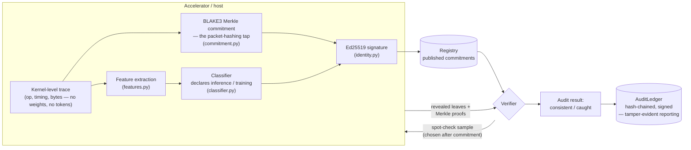

# Fides

**A reference implementation of a packet-hashing inference-only verification tap, built against the AI 2040: Plan A verification agenda.**

[AI 2040: Plan A](https://ai-2040.com/) is the AI Futures Project's (the team behind [AI 2027](https://ai-2027.com/)) recommendation for how the US and China could verifiably slow down the race to superintelligence. The plan's [verification supplement](https://ai-2040.com/supplements/verification-plan) argues the whole deal is only as strong as the ability to check compliance without relying on trust. Amodo Design, the hardware firm prototyping the plan's network-tap-and-recomputation approach, published a [SITREP](https://amododesign.com/ai-verification/plan-a-sitrep/) grading the 17 engineering workstreams that approach needs: 4 active, 6 not started, 7 not on track, and one (memory wipes) graded uncertain.

Fides is a from-scratch, tested, open-source testbed. It directly covers **2 of the 17** — the two that are both genuinely software-only and currently unstaffed:

| Workstream (SITREP grade) | What Fides does about it |
|---|---|
| **New TAP types & bandwidth limits** — *"sampling or packet hashing TAPs"* (not started) | `commitment.py`: a BLAKE3 Merkle-tree tap that commits to every event locally and cheaply, and only ever transmits full data for a small, auditor-chosen sample — instead of mirroring 100% of traffic to a recomputation server. |
| **Verification reporting** — integrity of what the recomputation server reports back to the verifier (not on track) | `ledger.py`: a hash-chained, signed audit log. A compromised or coerced auditor can't quietly rewrite a past finding without breaking the chain from that point forward. |

`classifier.py` + `features.py` (an interpretable classifier separating inference-shaped from training-shaped kernel traces) is **not** a claim on "Frontier recomputation algorithms" or any other graded workstream — recomputation algorithms verify that a specific claimed *output* is correct (TOPLOC/DiFR's job); this classifier answers the different question of what *kind* of compute a trace's shape implies. An earlier version of this README conflated the two; see `spec/PROTOCOL.md` section 4 for the corrected, precise scope, and the [Compute Verification Project](mailto:dreuter14@gmail.com)'s more advanced working draft (with an open red-teaming competition against it) as the actual state of the art on the real question.

`accumulator.py` + `zk_verification.py` is **not one of the 17** either — those 17 are specifically the network-tap-and-recomputation approach's workstreams. Amodo's own SITREP separately names "Cryptographic/ZKP verification" as a parallel track with its own roughly $100M in mobilized R&D funding, alongside a similar pool for physical-security R&D. The accumulator is a reference implementation aimed at that parallel track, not at any row in the table above.

Net honest count against the 17: of the roughly 9-11 that have *any* software-only component at all (the other 6 — passive optical TAPs, recomputation-server traffic capture, the storage-bank-to-inference-unit path, TAP installation, physical security and audits, and side-channel shielding — are physical by construction and no amount of software touches them), Fides directly closes 2 and leaves the rest — reproducible inference stack, network reproducibility, frontier recomputation algorithms, recomputation red-teaming, recomputation server security, and side-channel wardens — untouched. See the question this raises addressed directly in `spec/PROTOCOL.md` section 9.

## How it fits together



The prover (device/tap) never reveals the full trace by default — only the small sample the verifier asks for, chosen *after* the commitment is published, so the prover can't predict and hide the bad ones. This mirrors the "packet-based verification" appendix in the [AI 2040 verification supplement](https://ai-2040.com/supplements/verification-plan#appendix-packet-based-verification), which derives the same detection-probability math this repo implements and tests against.

## Two verification mechanisms, not one

`attestation.py` and `zk_verification.py` answer the same question — does the declared workload match what actually ran? — with two different, complementary guarantees:

| | `attestation.py` (Merkle + spot-check) | `zk_verification.py` (RSA accumulator) |
|---|---|---|
| Guarantee | Bounded detection **probability** per epoch, compounding toward certainty over repeated epochs (`security.py`) | Detection **certainty**: a forbidden op's non-membership witness provably cannot be constructed if the op is present |
| What's revealed | A small random sample of raw events, chosen after commitment | Only the accumulator value and non-membership witnesses — no event ever leaves the device |
| Cost | Cheap per epoch; needs many epochs for confidence | One accumulator + 3 witnesses per epoch; RSA exponentiation cost, no sampling |
| What it can express | Anything visible in the revealed sample (timing, byte counts, ordering) | Only set-membership claims ("no forbidden op occurred") over the accumulated set |

Running `examples/demo.py` section [6] reproduces the same subtle covert-training attack from section [3] and catches it 20/20 independent trials under the accumulator, against roughly 40-50% per epoch under sampling — not because one implementation is better than the other, but because they're different kinds of guarantee. See `spec/PROTOCOL.md` section 8 for when you'd actually want each.

## Quickstart

```bash
pip install -e ".[dev]"
python examples/demo.py     # honest device, a blatant liar, a subtle attacker, and a tampered ledger
pytest tests/ -v             # 59 tests
```

The demo runs a device sneaking one covert training step into otherwise-legitimate inference epochs while declaring everything "inference." In a real run it gets caught at epoch 3 out of 15 — consistent with the model's own prediction that a single epoch at this attack size has roughly a 46% catch probability, compounding to >99.7% by epoch 10 (see `examples/demo.py` section 5, and `spec/PROTOCOL.md` section 5).

## What's real here and what isn't

This is a **software testbed**, not hardware, and it should be read that way:

- `trace.py` **simulates** kernel-level execution traces with the statistical shape training and inference workloads are documented to have (backward-pass kernels, optimizer writes, KV-cache growth, gradient vs. activation all-reduce patterns). It does not hook into a real profiler (CUPTI/Nsight) or real GPU traffic. Swapping in a real trace source behind the same `ExecutionEpoch` interface is the natural next step and is the actual "not started" engineering work.
- The commitment, signature, spot-check, and ledger logic are real, tested, and not simplified toy versions of the cryptography — BLAKE3 Merkle proofs and Ed25519 signatures work exactly as they would in a production system, just running in-process instead of on tap hardware sitting inside a datacenter.
- The RSA accumulator in `accumulator.py` is likewise real, tested cryptography, not a simulation of one — but it has a genuine, named limitation: `trusted_setup()` generates the RSA modulus itself, and whoever runs that step could in principle know its factorization and forge proofs. A real deployment needs an actual trusted third party or a multi-party ceremony for that one step; this repo is honest about not solving it, in the same docstring that explains the rest of the math.
- The classifier is intentionally simple and interpretable, not adversarially robust. Section 4 of `spec/PROTOCOL.md` is explicit about what it would take to beat it, and points at the Compute Verification Project's open competition on exactly this problem.

## Repository layout

```
src/fides/
  trace.py         synthetic kernel-event trace generator (training / inference / mixed)
  features.py      privacy-preserving statistical fingerprint of a trace
  classifier.py     interpretable inference-vs-training classifier
  commitment.py     BLAKE3 Merkle commitment + proofs — the packet-hashing tap
  identity.py       Ed25519 device identity (signing / verification)
  attestation.py    Prover / Verifier: commit, spot-check reveal, audit
  ledger.py         hash-chained, signed audit ledger (tamper-evident reporting)
  security.py       detection-probability math (exact + Poisson approximation)
  accumulator.py    RSA accumulator: membership / non-membership proofs
  zk_verification.py ZKProver / ZKVerifier: certainty-based compliance proof
  protocol.py       Tap: wires prover + verifier + registry + ledger together
spec/PROTOCOL.md     RFC-style writeup: threat model, math, limitations
docs/ARCHITECTURE.md  the diagram above plus a walk through each module
examples/demo.py      end-to-end runnable demo, both mechanisms
tests/                59 tests, all passing
```

## References

- Shavit, 2023. [What does it take to catch a Chinchilla?](https://arxiv.org/abs/2303.11341)
- Wasil et al., 2024. [Verification Methods for International AI Agreements](https://arxiv.org/abs/2408.16074)
- Baker et al., 2025 (RAND). [Verifying International Agreements on AI](https://www.rand.org/pubs/working_papers/WRA4077-1.html)
- Petrie et al., 2025. [Flexible Hardware-Enabled Guarantees (flexHEG)](https://arxiv.org/abs/2506.15093)
- Scher & Thiergart, 2025. [Mechanisms to Verify International Agreements About AI Development](https://arxiv.org/abs/2506.15867)
- Harack et al., 2025 (Oxford AIGI). [Verification for International AI Governance](https://aigi.ox.ac.uk/publications/verification-for-international-ai-governance/)
- Rinberg et al., 2025. [Verifying LLM Inference to Detect Model Weight Exfiltration](https://arxiv.org/abs/2511.02620) — `security.py`'s Poisson approximation is tested against this derivation.
- Ong et al., 2025. [TOPLOC: A Locality Sensitive Hashing Scheme for Trustless Verifiable Inference](https://arxiv.org/abs/2501.16007) ([code](https://github.com/PrimeIntellect-ai/toploc))
- Karvonen et al., 2025. [DiFR: Inference Verification Despite Nondeterminism](https://arxiv.org/abs/2511.20621) — the "Token-DiFR" recomputation scheme referenced in the AI 2040 SITREP.
- Cankaya, 2026. [Bit-Exact AI Inference Verification Without Performance Tradeoffs](https://arxiv.org/abs/2606.00279)
- [AI 2040: Plan A — Verification Plan](https://ai-2040.com/supplements/verification-plan)
- [Amodo Design — AI 2040 Plan A Verification SITREP](https://amododesign.com/ai-verification/plan-a-sitrep/)
- Benaloh & de Mare, 1993. One-Way Accumulators: A Decentralized Alternative to Digital Signatures. EUROCRYPT '93.
- Barić & Pfitzmann, 1997. Collision-Free Accumulators and Fail-Stop Signature Schemes Without Trees. EUROCRYPT '97.
- Li, Li & Xue, 2007. Universal Accumulators with Efficient Nonmembership Proofs. ACNS 2007 — `accumulator.py`'s non-membership witness construction.

## License

MIT — see `LICENSE`.
