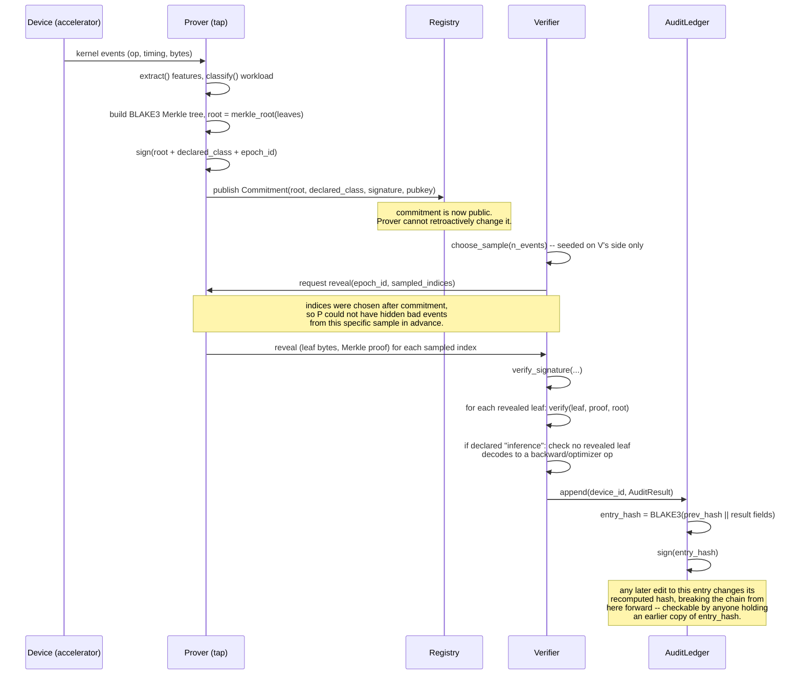
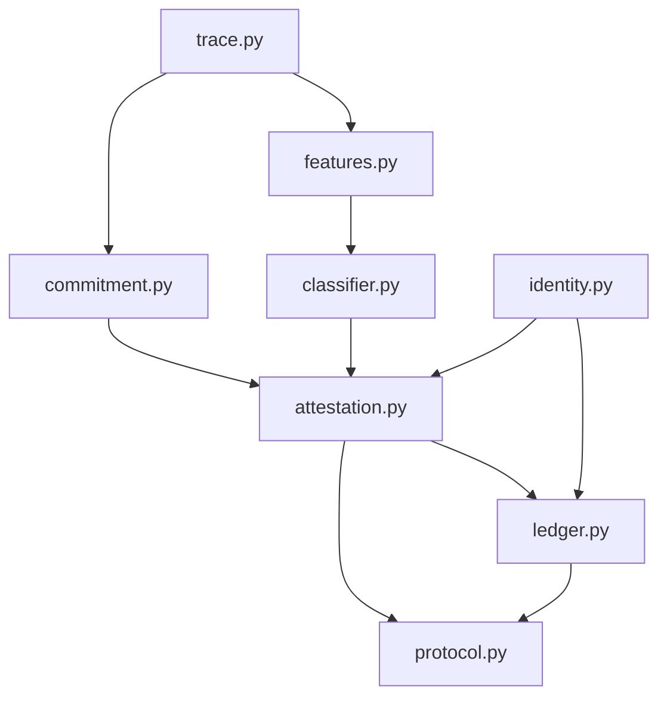

# Architecture: one epoch, start to finish

The README diagram shows the static shape of the system. This is the same thing as a sequence over time, for a single epoch — useful for seeing exactly when each cryptographic guarantee kicks in.

## Why the ordering matters

The two "Note" boxes above are the two load-bearing security properties, and both come from *ordering*, not from any single cryptographic primitive being unbreakable:

1. **Commit before sample.** The verifier's sampling indices are chosen after the root is already published. A prover trying to hide bad events would need to know in advance which indices get checked — but that choice hasn't been made yet when the commitment goes out.
2. **Hash-chain before publish, not after.** The ledger's tamper-evidence only holds if `entry_hash` reaches at least one party outside the auditor's control at the time the entry is created. `verify_chain()` run later against a *held-back* copy the auditor never let anyone see would not catch anything — this repo doesn't model an external publication step, and a real deployment would need one (see `spec/PROTOCOL.md` section 6).

## Module dependency graph

No module reaches back up the chain — `trace.py` and `identity.py` know nothing about the rest of the system, which is what makes it possible to swap `trace.py` for a real profiler-backed source (spec section 7) without touching the commitment, attestation, or ledger logic at all.
